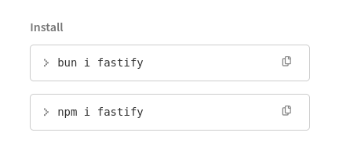
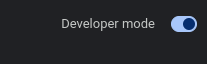
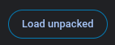

##GIVE ME BUN

A Random extension to automatically add bun commands onto pages. If you find bugs report them, quickly made.
It patches all commands related to Bun Install. Be it top right or the examples in the text

to install it run the following commands:
git clone https://github.com/Autumnlight02/giveMeBun
cd ./giveMeBun
bun i
bun run build

Then in chrome nagivate to chrome://extensions/
press on Developer mode [top right corner]

Press un Load unpacked

and point to the dist folder in this project.

Thats it and enjoy Bun!
